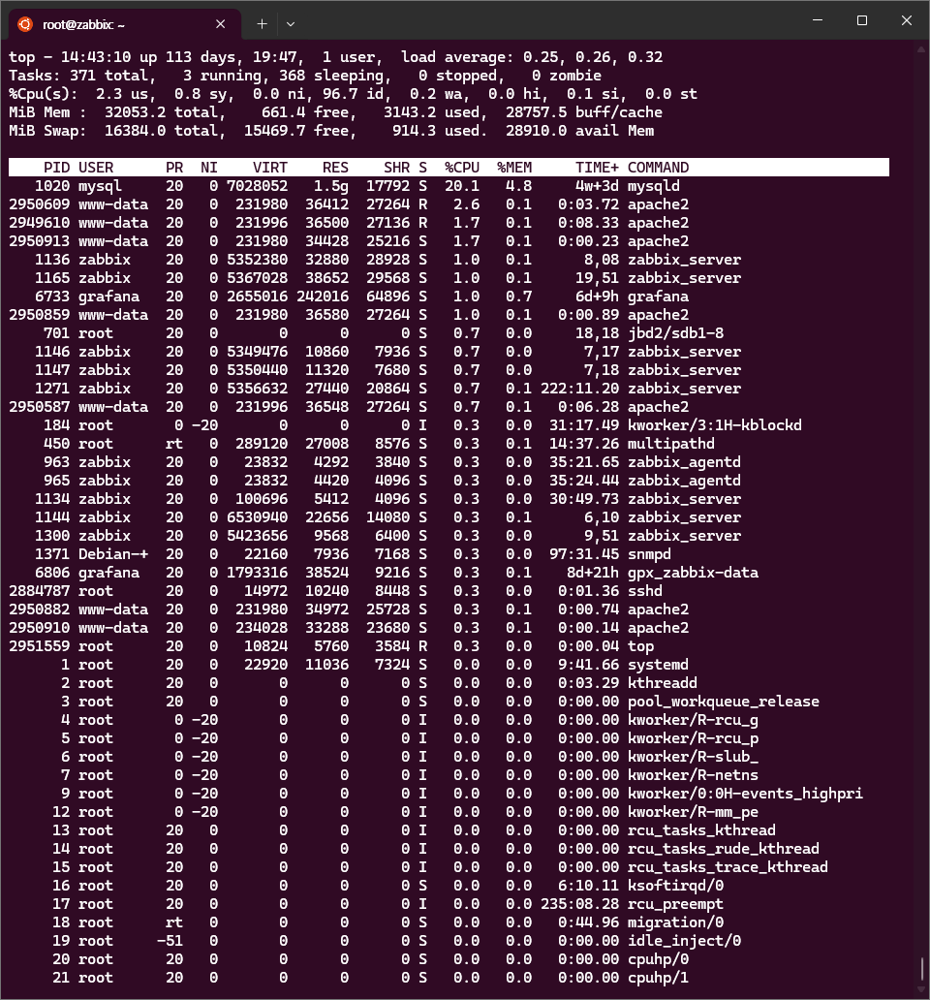
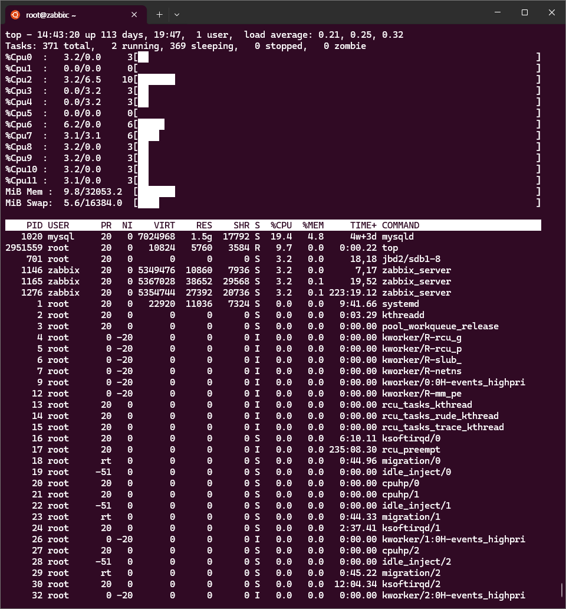
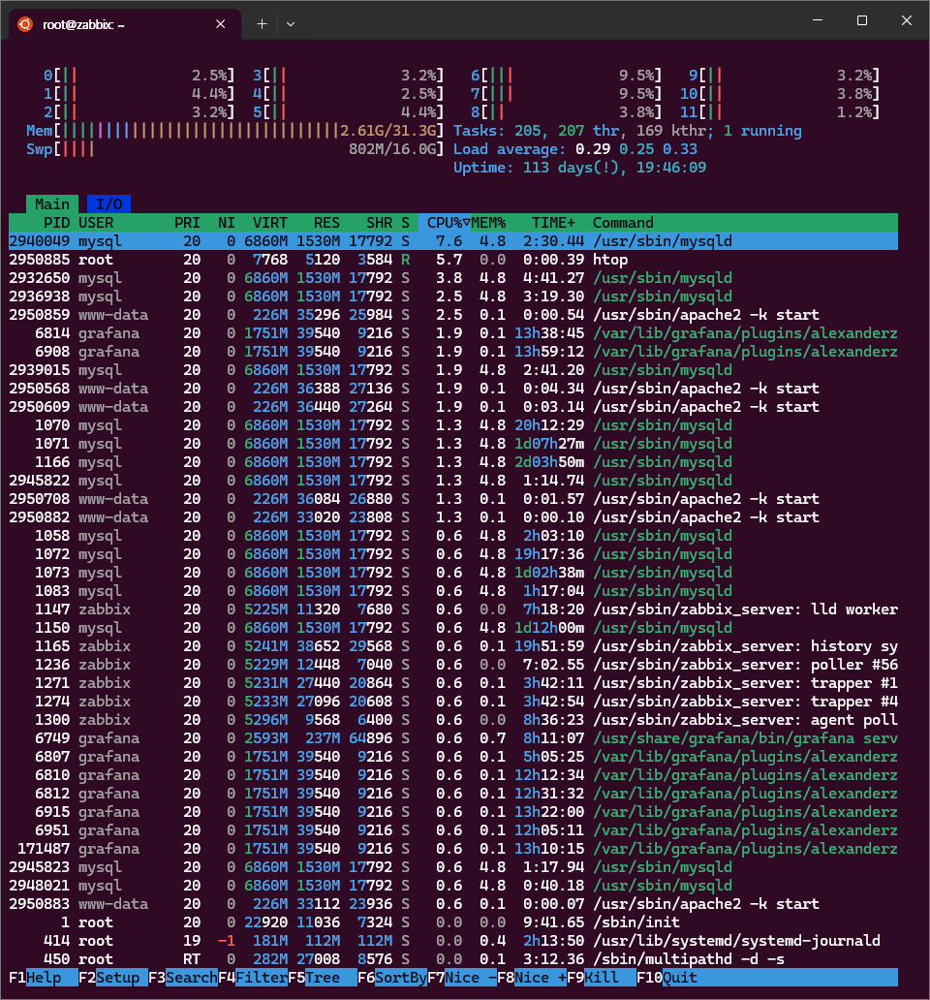
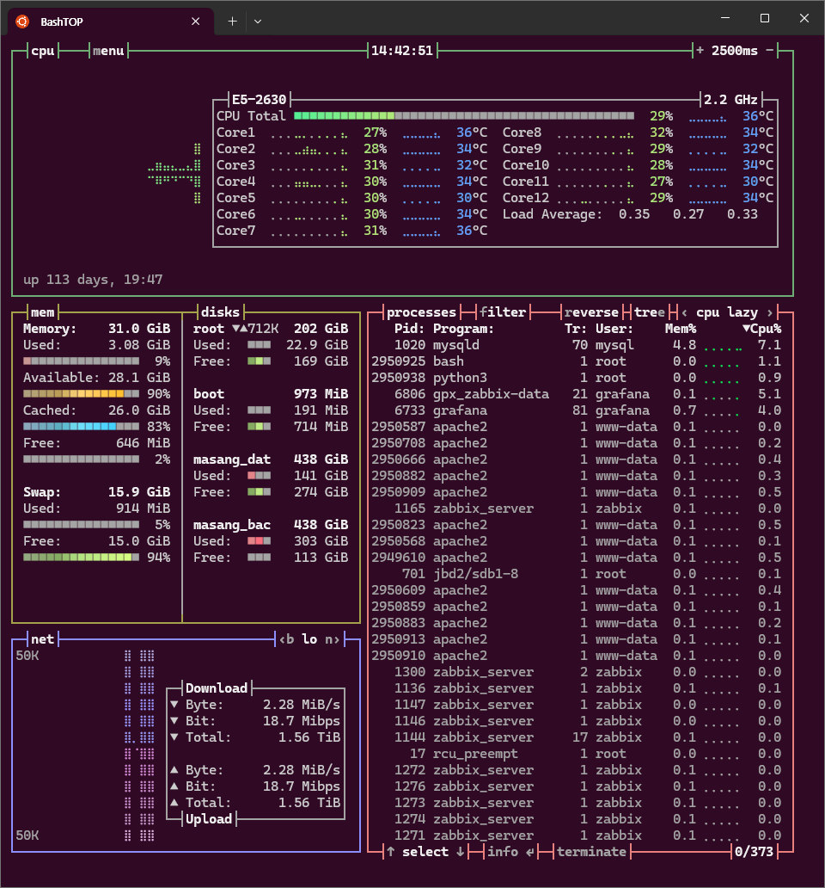

# Linux Server 리소스 사용률 (Resource Utilization) 모니터링

## 1. CPU 사용률 모니터링

### 실시간 모니터링
```bash
# 기본 패키지
top 
```


```bash
# 설치 필요
top + tt mm 
```


```bash
# 설치 필요
htop
```


```bash
# 설치 필요
bashtop
```


### 
- top, htop 은  P (process 순서 정렬) M (memory 순서 정렬) 단축키가 있습니다.

```bash
# 응용 명령 방법
top -p $(pgrep -d',' game_server)

# CPU 코어별 사용률
mpstat -P ALL 1

# CPU 코어별 기록 (10분 단위)
sar

# 게임 프로세스 CPU 사용률
ps -eo pid,ppid,cmd,%mem,%cpu --sort=-%cpu | head -10
```

### 임계값 설정
- **정상**: CPU 사용률 < 70%
- **주의**: CPU 사용률 70-85%
- **위험**: CPU 사용률 > 85%

## 2. 메모리 사용률 모니터링

### 메모리 상태 확인
```bash
# 전체 메모리 사용률
free -h
cat /proc/meminfo

# 게임 서버 메모리 사용량
pmap -x $(pgrep game_server)
ps aux --sort=-%mem | head -10
```

### 임계값 설정
- **정상**: 메모리 사용률 < 80%
- **주의**: 메모리 사용률 80-90%
- **위험**: 메모리 사용률 > 90%

## 3. 디스크 I/O 모니터링

### 디스크 사용률 및 성능
```bash
# 디스크 사용률
df -h
du -sh /game/logs/* | sort -hr

# I/O 성능 모니터링
iostat -x 1
iotop -o
```

### 임계값 설정
- **정상**: 디스크 사용률 < 80%, I/O Wait < 10%
- **주의**: 디스크 사용률 80-90%, I/O Wait 10-20%
- **위험**: 디스크 사용률 > 90%, I/O Wait > 20%

## 4. 네트워크 사용률 모니터링

### 네트워크 트래픽 확인
```bash
# 네트워크 인터페이스 통계
iftop -i eth0
nethogs
ss -tuln | grep :게임포트

# 대역폭 사용률
vnstat -i eth0
```

### 임계값 설정
- **정상**: 대역폭 사용률 < 70%
- **주의**: 대역폭 사용률 70-85%
- **위험**: 대역폭 사용률 > 85%

## 5. 자동화 모니터링 스크립트

### 리소스 모니터링 스크립트
```bash
#!/bin/bash
# resource_monitor.sh

LOG_FILE="/var/log/game_resource.log"
TIMESTAMP=$(date '+%Y-%m-%d %H:%M:%S')

# CPU 사용률
CPU_USAGE=$(top -bn1 | grep "Cpu(s)" | awk '{print $2}' | cut -d'%' -f1)

# 메모리 사용률
MEM_USAGE=$(free | grep Mem | awk '{printf("%.2f", ($3/$2) * 100.0)}')

# 디스크 사용률
DISK_USAGE=$(df -h / | awk 'NR==2 {print $5}' | cut -d'%' -f1)

# 로그 기록
echo "$TIMESTAMP CPU:${CPU_USAGE}% MEM:${MEM_USAGE}% DISK:${DISK_USAGE}%" >> $LOG_FILE

# 알림 조건
if (( $(echo "$CPU_USAGE > 85" | bc -l) )); then
    echo "ALERT: High CPU usage: ${CPU_USAGE}%"
fi
```

## 6. 게임 서비스 특화 모니터링

### 게임 서버 성능 지표
```bash
# 동시 접속자 수
netstat -an | grep :게임포트 | grep ESTABLISHED | wc -l

# 게임 프로세스 상태
systemctl status game-server
journalctl -u game-server -f

# 응답 시간 측정
ping -c 10 게임서버IP
```

### 주요 모니터링 포인트
- **동시 접속자 수**: 서버 용량 대비 접속률
- **응답 지연시간**: < 100ms (정상), > 500ms (위험)
- **패킷 손실률**: < 1% (정상), > 5% (위험)
- **메모리 누수**: 지속적인 메모리 증가 패턴 감지

## 7. 알림 및 대응 방안

### 자동 알림 설정
```bash
# crontab 설정
*/5 * * * * /home/game/scripts/resource_monitor.sh

# 임계값 초과 시 알림
if [ $CPU_USAGE -gt 85 ]; then
    mail -s "CPU Alert" siasia.linux@gmail.com < /dev/null
fi
```

### 대응 방안
- **CPU 과부하**: 프로세스 우선순위 조정, 스케일 아웃
- **메모리 부족**: 캐시 정리, 메모리 증설
- **디스크 포화**: 로그 정리, 스토리지 확장
- **네트워크 병목**: 트래픽 분산, 대역폭 증설
