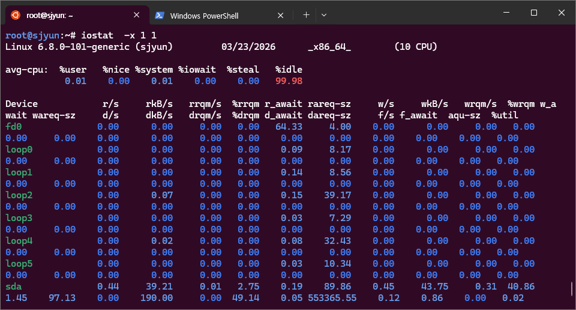
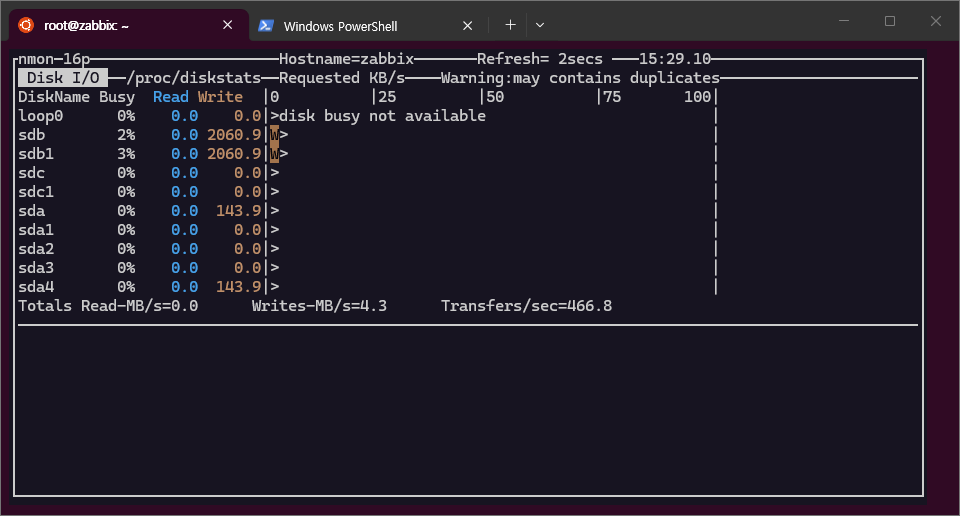
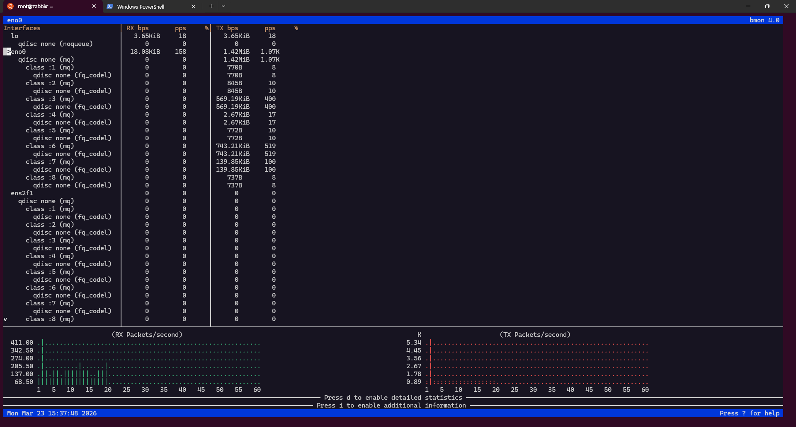

# Linux Server 리소스 사용률 (Resource Utilization) 모니터링

## 1. CPU 사용률 모니터링

### 실시간 모니터링
```bash
# 기본 패키지
top 
```


```bash
# 기본 패키지
top + tt mm 
```


```bash
# 설치 필요
htop
```


```bash
# 설치 필요
bashtop
```


### 단축키
- top, htop 은  P (process 순서 정렬) M (memory 순서 정렬) 단축키가 있습니다.

```bash
# 응용 명령 방법
top -p $(pgrep -d',' game_server)

# CPU 코어별 사용률
mpstat -P ALL 1

# top, htop, bashtop 은 **실시간 현황**
# CPU 코어별 **기록** (10분 단위) 
sar

# 게임 프로세스 CPU 사용률
ps -eo pid,ppid,cmd,%mem,%cpu --sort=-%cpu | head -10
```

### 임계값 설정
- **정상**: CPU 사용률 < 70%
- **주의**: CPU 사용률 70-85%
- **위험**: CPU 사용률 > 85%

## 2. 메모리 사용률 모니터링

### 메모리 상태 확인
```bash
# 전체 메모리 사용률
free -h
cat /proc/meminfo

# 게임 서버 메모리 사용량
pmap -x $(pgrep game_server)
ps aux --sort=-%mem | head -10
```

### 임계값 설정
- **정상**: 메모리 사용률 < 80%
- **주의**: 메모리 사용률 80-90%
- **위험**: 메모리 사용률 > 90%

## 3. 디스크 I/O 모니터링

### 디스크 사용률 및 성능
```bash
# 디스크 사용률
df -h
du -sch /game/logs/* | sort -hr

# I/O 성능 모니터링
# 처음 출력되는 수치는 현재 상태가 아닌, 부팅 이후의 누적 평균
iostat -x 1

# 첫 출력부터 실시간 값만 보려면 -y 옵션 사용
iostat -xy 1

# I/O 성능 모니터링
iotop -o

``` 
- 기록을 남겨야 하는 상황일때 사용 (zabbix 와 조합하여 모니터링 등)


### nmon ★★★
- 실시간 확인은 nmon 이 tui 환경으로 가시성이 조금 더 좋습니다. 

```bash
# 설치 필요 
nmon

# 진입 후 
d  
```



### 임계값 설정
- **정상**: 디스크 사용률 < 80%, I/O Wait < 10%
- **주의**: 디스크 사용률 80-90%, I/O Wait 10-20%
- **위험**: 디스크 사용률 > 90%, I/O Wait > 20%

## 4. 네트워크 사용률 모니터링

### 네트워크 트래픽 확인
```bash
# 네트워크 인터페이스 통계
iftop -i eth0
nethogs
ss -tuln | grep :게임포트

# 대역폭 사용률
vnstat -i eth0
```

### bmon ★★★
- 실시간 확인은 bmon 이 tui 환경으로 가시성이 조금 더 좋습니다.

```bash
# 설치 필요
bmon
```


### 임계값 설정
- **정상**: 대역폭 사용률 < 70%
- **주의**: 대역폭 사용률 70-85%
- **위험**: 대역폭 사용률 > 85%

## 5. 자동화 모니터링 스크립트

### 리소스 모니터링 스크립트
```bash
#!/bin/bash
# resource_monitor.sh

LOG_FILE="/var/log/game_resource.log"
TIMESTAMP=$(date '+%Y-%m-%d %H:%M:%S')

# CPU 사용률 (mpstat 사용, 실시간 1초 측정)
CPU_USAGE=$(mpstat 1 1 | awk '/Average/ {printf "%.1f", 100-$NF}')

# 메모리 사용률 (available 기반)
MEM_USAGE=$(free | grep Mem | awk '{printf("%.2f", (1 - $7/$2) * 100.0)}')

# 스왑 사용률
SWAP_USAGE=$(free | grep Swap | awk '{if($2>0) printf("%.2f", ($3/$2)*100.0); else print "0"}')

# 디스크 사용률
DISK_USAGE=$(df -h / | awk 'NR==2 {print $5}' | cut -d'%' -f1)

# I/O Wait
IO_WAIT=$(iostat -c 1 2 | awk '/^ /{val=$4} END{printf "%.1f", val}')

# Load Average (1분)
LOAD_AVG=$(cat /proc/loadavg | awk '{print $1}')
CPU_CORES=$(nproc)

# 로그 기록
echo "$TIMESTAMP CPU:${CPU_USAGE}% MEM:${MEM_USAGE}% SWAP:${SWAP_USAGE}% DISK:${DISK_USAGE}% IO_WAIT:${IO_WAIT}% LOAD:${LOAD_AVG}/${CPU_CORES}cores" >> $LOG_FILE

# 알림 조건
if (( $(echo "$CPU_USAGE > 85" | bc -l) )); then
    echo "ALERT: High CPU usage: ${CPU_USAGE}%"
fi

if (( $(echo "$MEM_USAGE > 90" | bc -l) )); then
    echo "ALERT: High Memory usage: ${MEM_USAGE}%"
fi

if (( $(echo "$SWAP_USAGE > 10" | bc -l) )); then
    echo "ALERT: Swap usage detected: ${SWAP_USAGE}%"
fi

if (( $(echo "$IO_WAIT > 20" | bc -l) )); then
    echo "ALERT: High I/O Wait: ${IO_WAIT}%"
fi
```

## 6. 게임 서비스 특화 모니터링

### 게임 서버 성능 지표
```bash
# 동시 접속자 수
netstat -an | grep :게임포트 | grep ESTABLISHED | wc -l

# 게임 프로세스 상태
systemctl status game-server
journalctl -u game-server -f

```

### 주요 모니터링 포인트
- **동시 접속자 수**: 서버 용량 대비 접속률
- **응답 지연시간**: < 100ms (정상), > 500ms (위험)
- **패킷 손실률**: < 1% (정상), > 5% (위험)
- **메모리 누수**: 지속적인 메모리 증가 패턴 감지

## 7. 시스템 안정성 모니터링

### swappiness 설정 가이드
- 게임 서버에서 스왑 발생 시 디스크 I/O 레이턴시가 직접적으로 게임 응답 지연에 영향을 줍니다.
```bash
# 현재 설정 확인
cat /proc/sys/vm/swappiness

# 게임/DB 서버 권장값: 1~10
sudo sysctl vm.swappiness=10

# 영구 적용
echo "vm.swappiness=10" | sudo tee -a /etc/sysctl.d/99-tuning.conf
sudo sysctl -p /etc/sysctl.d/99-tuning.conf
```

| 서버 용도          | 권장 swappiness |
|--------------------|-----------------|
| DB 서버            | 1~10            |
| 게임 서버          | 1~10            |
| 일반 애플리케이션  | 10~30           |
| 리눅스 기본값      | 60 (과도함)     |

### OOM Killer 로그 확인
- 게임 서버가 갑자기 종료된 경우 OOM Killer에 의한 강제 종료 여부를 확인합니다.
```bash
# OOM Killer 발생 확인
dmesg | grep -i oom
journalctl -k | grep -i "out of memory"

# 특정 프로세스의 OOM 점수 확인 (낮을수록 kill 대상에서 제외)
cat /proc/$(pgrep game_server)/oom_score

# 게임 서버 프로세스를 OOM Killer 대상에서 보호
echo -1000 | sudo tee /proc/$(pgrep game_server)/oom_score_adj
```

### 프로세스 File Descriptor 모니터링
- 게임 서버는 동시 접속자 수만큼 소켓 FD를 사용하므로 고갈에 주의해야 합니다.
```bash
# 게임 서버 프로세스의 FD 사용 현황
ls -la /proc/$(pgrep game_server)/fd | wc -l

# 프로세스별 FD 제한 확인
cat /proc/$(pgrep game_server)/limits | grep "open files"

# 시스템 전체 FD 사용 현황
cat /proc/sys/fs/file-nr
# 출력: 사용중 | 할당후미사용 | 최대값
```

### TCP 커넥션 상태 분포
- TIME_WAIT 폭증, CLOSE_WAIT 누적 등 비정상 커넥션 상태를 감지합니다.
```bash
# TCP 상태별 카운트
ss -tan | awk 'NR>1 {print $1}' | sort | uniq -c | sort -rn

# TIME_WAIT 가 많으면 커널 파라미터 튜닝 검토
# CLOSE_WAIT 가 많으면 애플리케이션에서 소켓을 제대로 닫지 않는 것
```

| TCP 상태     | 정상 기준                    | 비정상 시 원인                    |
|--------------|------------------------------|-----------------------------------|
| ESTABLISHED  | 동접자 수와 비례             | -                                 |
| TIME_WAIT    | 전체 커넥션의 20% 이하      | 짧은 커넥션 반복, 튜닝 필요      |
| CLOSE_WAIT   | 거의 0에 가까워야 함        | 애플리케이션 소켓 미해제 (버그)  |

## 8. 알림 및 대응 방안
- 서버 하나씩 확인하기 어려우니, zabbix monitor (grafana) 에서 모니터링을 진행 하고 있습니다.

### 대응 방안
- **CPU 과부하**: 프로세스 우선순위 조정, 스케일 아웃
- **메모리 부족**: 캐시 정리, 메모리 증설
- **디스크 포화**: 로그 정리, 스토리지 확장
- **네트워크 병목**: 트래픽 분산, 대역폭 증설

## 9. 모니터링 도구별 데이터 수집 방식 비교

### 수집 방식 차이
- **sar**: 구간 평균값 (수집 간격 동안의 `/proc/stat` 등 누적 카운터 델타 계산)
- **zabbix**: 수집 시점의 스냅샷 (아이템에 따라 구간 평균에 가까운 경우도 있음)

```
CPU: 30% 30% 30% 95% 95% 95% 30% 30% 30% 30%
     ↑                                      ↑
   10:00                                  10:10

sar    → 49.5% (구간 평균, 실제 부하를 반영)
zabbix → 30% (10:00에 수집했다면) 또는 95% (10:03에 수집했다면)
```

### 도구별 비교

| 항목              | sar (구간 평균)              | zabbix (스냅샷)                |
|-------------------|------------------------------|--------------------------------|
| 수집 방식         | 구간 전체 평균               | 수집 시점 값                   |
| 기본 수집 간격    | 10분                         | 설정에 따라 (1분/3분/5분)      |
| 구간 전체 부하    | ✅ 정확                      | ❌ 수집 순간만 반영            |
| 순간 피크 감지    | ❌ 평균에 희석               | ✅ 수집 시점에 걸리면 감지     |
| 실제 체감 반영    | ✅ 더 가까움                 | ❌ 수집 타이밍에 의존          |
| 주 용도           | 사후 분석/트렌드 확인        | 실시간 알림/모니터링           |

### 권장 운영 방식
- **실시간 알림**: zabbix (수집 간격을 짧게 설정)
- **사후 분석**: sar (구간 평균으로 전반적 부하 추이 파악)
- 둘 다 병행하는 것이 가장 효과적입니다.

### 참고
- zabbix의 `system.cpu.util` 아이템은 내부적으로 `/proc/stat` 델타 계산을 사용하므로, 직전 수집~현재 수집 사이의 구간 평균에 가까운 값을 반환합니다. 이 경우 sar와 정확도 차이가 거의 없습니다.
- sar에서 높은 수치가 기록되었다면 해당 구간 동안 지속적으로 부하가 높았다는 의미이므로, 스냅샷 대비 더 심각한 상황일 수 있습니다.
