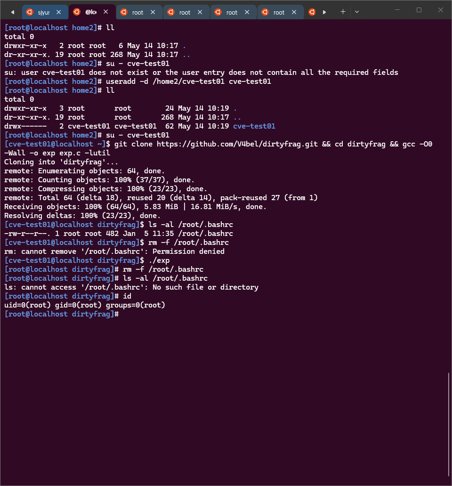

# Linux LPE CVE — 공격 시나리오 및 실효성 분석

## 목차

| 섹션 |
|------|
| [1. 개요](#1-개요) / [2. sudo 환경과의 차이](#2-sudo-환경과의-차이) / [3. 실효성 있는 공격 시나리오](#3-실효성-있는-공격-시나리오) |
| [4. 시나리오별 공격 흐름](#4-시나리오별-공격-흐름) / [5. 대응 방안](#5-대응-방안) / [6. 임시 조치 후 침해 여부 확인](#6-임시-조치-후-침해-여부-확인) |

---



---

## 1. 개요

CVE-2026-31431 (Copy Fail), CVE-2026-43284 / CVE-2026-43500 (Dirty Frag), CVE-2026-46300 (Fragnesia)은 모두 **비권한 로컬 사용자 → root 권한 상승(LPE)** 취약점입니다.

"일반 계정에서 `sudo`로 root를 취득할 수 있는데 실효성이 있는가?"라는 질문에 대한 답은 **전제가 다르다**는 것입니다.

| 구분           | sudo 가능 계정                | 이 CVE 대상 계정                                 |
|----------------|-------------------------------|--------------------------------------------------|
| 신뢰 수준      | 관리자가 명시적으로 신뢰 부여 | 신뢰되지 않은 비권한 계정                        |
| 예시           | 운영자, 개발자 계정           | `www-data`, `postgres`, `nobody`, 앱 서비스 계정 |
| root 취득 방법 | sudo (정상 경로)              | 이 CVE (비정상 경로)                             |

[⬆ 목차로 돌아가기](#목차)

---

## 2. sudo 환경과의 차이

sudo로 root를 취득할 수 있는 계정은 이미 **신뢰된 사용자**입니다. 이 CVE는 그런 계정에는 추가적인 위협이 되지 않습니다.

이 CVE가 위협이 되는 것은 **sudo 권한이 없는 계정**이 시스템에 존재할 때입니다.

```
일반적인 Linux 서버 계정 구조:

root          ← 최고 권한
├── admin     ← sudo 가능 (관리자)
├── www-data  ← sudo 없음 (웹서버 프로세스)
├── postgres  ← sudo 없음 (DB 프로세스)
├── appuser   ← sudo 없음 (애플리케이션 서비스)
└── nobody    ← sudo 없음 (최소 권한 프로세스)
```

`www-data`, `postgres` 등은 정상적으로는 절대 root가 될 수 없습니다. 이 CVE는 그 경계를 무너뜨립니다.

[⬆ 목차로 돌아가기](#목차)

---

## 3. 실효성 있는 공격 시나리오

| 시나리오              | 진입점                        | CVE 역할                        | 위험도 |
|-----------------------|-------------------------------|---------------------------------|--------|
| 웹 취약점 → 권한 상승 | RCE로 `www-data` 쉘 획득      | `www-data` → root               | ★★★★★  |
| 컨테이너 탈출         | 컨테이너 내부 비권한 프로세스 | 컨테이너 → 호스트 root          | ★★★★★  |
| 공유 서버 내부자      | sudo 없는 일반 계정           | 일반 계정 → root                | ★★★★☆  |
| 서비스 계정 탈취      | DB/앱 프로세스 취약점         | 서비스 계정 → root              | ★★★★☆  |
| on-disk 무결성 우회   | 임의 계정                     | page cache 직접 수정 → IDS 우회 | ★★★☆☆  |

[⬆ 목차로 돌아가기](#목차)

---

## 4. 시나리오별 공격 흐름

### 웹 취약점 → 권한 상승 (가장 일반적)

```
외부 공격자
    │
    ▼
웹 취약점 (SQL Injection, RCE, SSRF 등)
    │
    ▼
www-data 쉘 획득 (sudo 없음)
    │
    ▼
CVE-2026-31431 / CVE-2026-43284+43500 / CVE-2026-46300 실행
    │
    ▼
root 권한 획득
    │
    ▼
백도어 설치 / 데이터 탈취 / 횡적 이동
```

### 컨테이너 탈출

```
컨테이너 내부 비권한 프로세스
    │
    ▼
page cache write primitive 획득
(컨테이너와 호스트가 커널을 공유)
    │
    ▼
호스트 커널 page cache 덮어쓰기
    │
    ▼
호스트 root 권한 획득
```

Copy Fail(CVE-2026-31431) 원문:
> "page-cache write bypasses on-disk file-integrity tools and crosses container boundaries"

### on-disk 무결성 우회

일반적인 권한 상승은 파일시스템에 흔적을 남깁니다. 이 CVE는 **page cache(메모리)를 직접 수정**하므로:

- 디스크의 실제 파일은 변경되지 않음
- AIDE, Tripwire 등 파일 무결성 도구 우회
- 재부팅 시 원상복구 (흔적 제거)

[⬆ 목차로 돌아가기](#목차)

---

## 5. 대응 방안

### 근본 대응 — 커널 패치

```bash
# Ubuntu / Debian
sudo apt update && sudo apt dist-upgrade -y && sudo reboot

# RHEL / CentOS / Amazon Linux
sudo yum update kernel -y && sudo reboot
```

### 컨테이너 환경 추가 대응

```bash
# seccomp 프로파일로 splice() 제한
# Docker 기본 seccomp 프로파일 적용 확인
docker inspect <container> | grep -i seccomp

# gVisor(runsc) 사용 — 커널 공유 없는 샌드박스
```

### 서비스 계정 최소 권한 원칙 재확인

```bash
# sudo 권한 없는 계정 목록 확인
grep -v "sudo\|wheel\|admin" /etc/group | grep -v "^#"

# www-data, postgres 등 서비스 계정 sudo 여부 확인
sudo -l -U www-data 2>/dev/null
sudo -l -U postgres 2>/dev/null
```

[⬆ 목차로 돌아가기](#목차)

---

## 6. 임시 조치 후 침해 여부 확인

임시 조치(모듈 blacklist)는 **추가 공격을 막는 것**입니다. Copy Fail 공개일(2026-04-22) 이후 이미 침해됐을 가능성을 별도로 확인해야 합니다.

### 비정상 프로세스 / 계정

```bash
# root 권한으로 실행 중인 비정상 프로세스
ps aux | awk '$1=="root" {print}' | grep -v -E "systemd|kernel|sshd|cron|rsyslog|dbus"

# 최근 생성된 SUID 파일 (권한 상승 흔적)
find / -perm -4000 -newer /etc/passwd 2>/dev/null

# UID 0 계정 확인
awk -F: '$3==0 {print "UID0:", $1}' /etc/passwd

# 최근 로그인 이력
last | head -20
lastb | head -20
```

### 비정상 네트워크 연결

```bash
# 외부로 연결 중인 세션
ss -tnp | grep ESTABLISHED

# 비정상 리스닝 포트
ss -tlnp | grep -v -E ":22|:80|:443|:3306|:5432"

# /tmp, /dev/shm 실행 파일
find /tmp /dev/shm -type f -executable 2>/dev/null
```

### 패키지 파일 변조 확인

page-cache write로 root 획득 후 패키지 파일을 변조하는 것이 가능합니다. 디스크의 실제 파일과 메모리의 page cache가 다를 수 있으므로 **재부팅 전후 모두 확인**합니다.

```bash
# Ubuntu / Debian — dpkg로 설치 파일 무결성 검사
sudo dpkg --verify 2>/dev/null | grep -v "^$"
# 출력 없으면 정상, 변조된 파일은 경고 출력

# 특정 패키지 파일 검사
sudo dpkg --verify openssh-server sudo bash 2>/dev/null

# RHEL / CentOS — rpm으로 설치 파일 무결성 검사
sudo rpm -Va 2>/dev/null | grep -v "^$"
# S: 파일 크기 변조, M: 권한 변조, 5: MD5 불일치

# 핵심 바이너리만 검사
sudo rpm -V openssh-server sudo bash coreutils 2>/dev/null
```

🟡 page-cache write 특성상 **디스크에 흔적을 남기지 않습니다.** 재부팅하면 page cache가 초기화되므로 익스플로잇 실행 흔적은 사라집니다. 단, 공격자가 재부팅 후에도 유지되는 백도어(crontab, systemd unit, SUID 파일 등)를 심었다면 디스크에 남습니다.

### 로그 확인 (CVE 공개일 이후)

```bash
# 2026-04-22 이후 root 세션 (Copy Fail 공개일 기준)
journalctl --since "2026-04-22" | grep -i "session opened for user root"

# 2026-04-22 이후 SSH 접속
journalctl --since "2026-04-22" -u ssh | grep -E "Accepted|Failed|Invalid"

# sudo / su 이력
grep -E "sudo|su|ROOT" /var/log/auth.log | grep "2026-04\|2026-05" | tail -50

# crontab 백도어 확인
crontab -l 2>/dev/null
ls -la /etc/cron* /var/spool/cron/crontabs/ 2>/dev/null
```

### 침해 확인 시 대응

모듈 blacklist만으로는 이미 심어진 백도어를 제거할 수 없습니다.

| 상황           | 대응                                    |
|----------------|-----------------------------------------|
| 침해 흔적 없음 | 커널 패치 후 모니터링 유지              |
| 침해 의심      | 포렌식 이미지 확보 후 OS 재설치         |
| 침해 확인      | 즉시 네트워크 격리 → 포렌식 → OS 재설치 |

[⬆ 목차로 돌아가기](#목차)

---

## 참고 자료

- [cve_2026_31431_copy_fail.md](./cve_2026_31431_copy_fail.md) — CVE-2026-31431 (Copy Fail)
- [cve_2026_43284_dirty_frag.md](./cve_2026_43284_dirty_frag.md) — CVE-2026-43284 (Dirty Frag)
- [cve_2026_43500_dirty_frag.md](./cve_2026_43500_dirty_frag.md) — CVE-2026-43500 (Dirty Frag)
- [cve_2026_46300_fragnesia.md](./cve_2026_46300_fragnesia.md) — CVE-2026-46300 (Fragnesia)
- Copy Fail: [copy.fail](https://copy.fail/) — ★★☆☆☆
- Dirty Frag: [github.com/V4bel/dirtyfrag](https://github.com/V4bel/dirtyfrag) — ★★☆☆☆

---

## 통계


---

**작성일**: 2026-05-14

**마지막 업데이트**: 2026-05-18

© 2026 siasia86. Licensed under CC BY 4.0.
