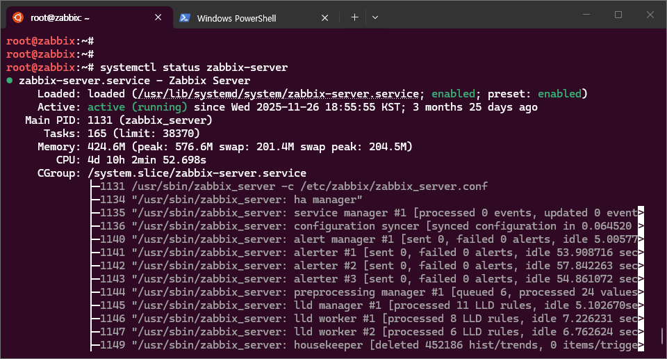
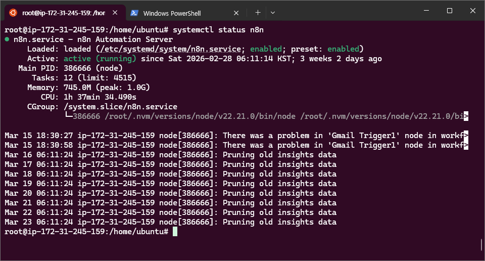

# 게임 서비스 인프라 운영 핵심 지표 5가지

> 교육일: 2026-03-19  
> 대상: 인프라 / 시스템 엔지니어  
> 목적: 게임 서비스 안정 운영을 위한 핵심 모니터링 지표와 실무 대응 방안을 학습합니다.

---

## 목차

1. [서비스 가용성 (Availability)](#1-서비스-가용성-availability)
2. [응답 시간 (Latency)](#2-응답-시간-latency)
3. [동시 접속자 수 (CCU)](#3-동시-접속자-수-ccu)
4. [리소스 사용률 (Resource Utilization)](#4-리소스-사용률-resource-utilization)
5. [보안 지표 (Security Metrics)](#5-보안-지표-security-metrics)

---

## 1. 서비스 가용성 (Availability)

### 1-1. 정의

서비스가 정상적으로 동작하여 사용자가 접속할 수 있는 시간의 비율을 의미합니다.  
게임 서비스에서는 **점검 시간을 제외한 실제 서비스 가능 시간**이 핵심입니다.

### 1-2. 산출 공식

```
가용성(%) = (총 운영 시간 - 장애 시간) / 총 운영 시간 × 100
```

| 등급 | 가용성 | 연간 허용 다운타임 |
|------|--------|-------------------|
| 99.9% (Three Nines) | 8시간 45분 | 일반 게임 서비스 |
| 99.95% | 4시간 22분 | 대형 온라인 게임 |
| 99.99% (Four Nines) | 52분 | 결제/인증 시스템 |

### 1-3. 게임 서비스의 특수성

- 정기 점검(주 1회 등)은 가용성 산정에서 **제외**하는 것이 일반적입니다.
- 긴급 점검이나 롤백은 **장애 시간에 포함** 됩니다.
- 채널/월드 단위의 부분 장애도 가용성에 영향을 줍니다.

### 1-4. 모니터링 및 확인 방법

#### Linux

```bash
# 프로세스 생존 여부를 확인합니다.
systemctl status game-server.service
```

**출력 예시 및 항목 설명:**

```
 Loaded: loaded (/usr/lib/systemd/system/game-server.service; enabled; preset: enabled)
                                                                -------          -------
                                                                (1)              (2)
 Active: active (running) since Sat 2026-02-28 06:11:14 KST; 2 weeks 5 days ago
         ----------------
         (3)
```

| 번호 | 항목 | 설명 |
|------|------|------|
| (1) | `enabled` | 서버 부팅 시 자동 시작되도록 설정된 상태입니다 (`systemctl enable` 으로 설정) |
| (2) | `preset: enabled` | 배포판(OS)의 기본 정책에 의해 활성화된 상태를 의미합니다 |
| (3) | `active (running)` | 현재 서비스가 정상적으로 실행 중인 상태입니다 |

> 주요 Active 상태값: `active (running)` 실행 중 / `inactive (dead)` 중지됨 / `failed` 실행 실패
# zabbix

# n8n 


```bash
# 게임 서버 포트(예: 7777)의 리스닝 상태를 확인합니다.
ss -tlnp | grep 7777

# HTTP 기반 Health Check를 수행합니다 (API 서버)
curl -s -o /dev/null -w "%{http_code}" http://localhost:8080/health

# 서버 가동 시간을 확인합니다.
uptime
```

**출력 예시 및 항목 설명:**

```
 17:05:30 up 19 days,  10:54,  2 users,  load average: 0.35, 0.42, 0.38
 --------    -----------------  -------   ----------------------------
 (1)         (2)                (3)       (4)
```

| 번호 | 항목 | 설명 |
|------|------|------|
| (1) | 현재 시간 | 서버의 현재 시각입니다 |
| (2) | 가동 시간 | 마지막 부팅 이후 경과 시간입니다 (재시작 없이 운영된 기간) |
| (3) | 접속 사용자 수 | 현재 서버에 로그인한 사용자 수입니다 |
| (4) | Load Average | 1분 / 5분 / 15분 평균 시스템 부하입니다 |

> **Load Average 판단 기준** (CPU 코어 수 기준으로 해석합니다)
> - CPU 코어 수 확인: `nproc` 또는 `lscpu | grep "^CPU(s)"`
> - Load Average ≤ 코어 수: 정상 범위입니다
> - Load Average > 코어 수: 과부하 상태이며, 프로세스가 대기 중임을 의미합니다
> - 예) 4코어 서버에서 load average 4.0 = 100% 사용, 8.0 = 200% (대기 발생)

```bash
# 최근 24시간 내 서비스 재시작 이력을 조회합니다.
journalctl -u game-server.service --since "24 hours ago" | grep -i "start\|stop\|fail"
```

#### Windows

```powershell
# 서비스 상태를 확인합니다.
Get-Service -Name "GameServerService" | Select-Object Status, StartType

# 포트 리스닝 상태를 확인합니다.
netstat -an | findstr "7777"

# 이벤트 로그에서 최근 1일간 서비스 장애 이력을 조회합니다.
Get-EventLog -LogName System -EntryType Error -After (Get-Date).AddDays(-1) |
  Where-Object { $_.Source -match "Service" }

# 시스템 부팅 시간을 확인합니다.
systeminfo | findstr "부팅 시간"
```

### 1-5. 장애 대응 흐름도

```
+------------------+     장애 감지      +------------------+
|   모니터링 도구  |------------------>|   알림 발생      |
|   (Prometheus,   |                   |  (Slack, 문자,   |
|    Zabbix 등)    |                   |   mail, 전화 등) |
+------------------+                   +------------------+
                                                |
                                                v
+------------------+     원인 분석      +------------------+
|   서비스 복구    |<------------------|   담당자 확인    |
|   (재시작/롤백/  |                   |   (로그 분석,    |
|    장애 조치)    |                   |    상태 점검)    |
+------------------+                   +------------------+
         |
         v
+------------------+
|   사후 보고서    |
|   (RCA 작성)     |
+------------------+

**RCA(Root Cause Analysis, 근본 원인 분석)**
```

### 1-6. 실무 권장 사항

- Health Check 주기는 **10~30초**를 권장합니다 (너무 짧으면 오탐이 발생할 수 있습니다)
- 장애 자동 전환(Failover)을 위해 Keepalived(VIP), HAProxy, AWS ALB Target Group 등을 활용하실 수 있습니다
- 장애 등급(P1~P4)을 사전에 정의가 필요 합니다.

### 1-7. 참고 자료

- [SLA Uptime 계산기 및 등급별 다운타임 산출](https://devopsprojectshq.com/tools/sla-tool/)
- [99.9%와 99.99% SLA 차이점 상세 설명](https://medium.com/axel-springer-tech/whats-the-difference-between-99-9-and-99-99-sla-uptime-489e201a3c7b)
- [Uptime 비율별 허용 다운타임 계산](https://onlineornot.com/uptime-calculator)
- [SLA Uptime 산출 공식 및 활용 방법](https://deadly.hostingpost.com/)

---

## 2. 응답 시간 (Latency)

### 2-1. 정의

클라이언트의 요청부터 서버의 응답까지 걸리는 시간을 의미합니다.  
게임에서는 **네트워크 지연(RTT)**과 **서버 처리 시간** 모두 중요합니다.

### 2-2. 주요 측정 구간

```
+----------+    RTT     +-----------+   처리시간   +----------+
|  Client  |<---------->|  Network  |<------------>|  Server  |
| (게이머) |            | (ISP/CDN) |              | (게임/DB)|
+----------+            +-----------+              +----------+
     ^                                                  |
     |               전체 응답 시간 (E2E Latency)       |
     +--------------------------------------------------+
```

| 구간 | 목표값 | 비고 |
|------|--------|------|
| 네트워크 RTT | < 50ms | 국내 기준이며, 해외는 리전별로 상이합니다 |
| 서버 처리 시간 | < 100ms | API 서버 기준입니다 |
| DB 쿼리 시간 | < 30ms | Slow Query 판단 기준입니다 |
| 전체 E2E | < 200ms | FPS/액션 게임은 100ms 미만을 권장합니다 |

### 2-3. 모니터링 및 확인 방법

#### Linux

```bash
# 네트워크 왕복 시간(RTT)을 측정합니다.
ping -c 10 game-server.example.com

Example)
ping -c 10 naver.com
PING naver.com (223.130.192.248) 56(84) bytes of data.

--- naver.com ping statistics ---
10 packets transmitted, 0 received, 100% packet loss, time 9250ms


# TCP 연결의 각 단계별 소요 시간을 측정합니다.
curl -s -o /dev/null -w "DNS: %{time_namelookup}s\nConnect: %{time_connect}s\nTTFB: %{time_starttransfer}s\nTotal: %{time_total}s\n" http://api.game.com/status
curl -w "%{time_total}\n" game-server.example.com 

# MTR을 사용하여 네트워크 경로별 지연 구간을 분석합니다.
mtr --report --report-cycles 20 game-server.example.com

# MySQL의 Slow Query를 확인합니다.
mysqladmin -u root -p processlist | grep -i "query"
tail -f /var/log/mysql/slow-query.log

# Redis의 응답 시간을 측정합니다.
redis-cli --latency -h 127.0.0.1 -p 6379
```

#### Windows

```powershell
# 네트워크 왕복 시간(RTT)을 측정합니다.
Test-Connection -ComputerName game-server.example.com -Count 10

# 네트워크 경로를 추적합니다.
tracert game-server.example.com

# 특정 포트에 대한 연결 소요 시간을 측정합니다.
Measure-Command { Test-NetConnection -ComputerName game-server.example.com -Port 7777 }

# 성능 카운터를 통해 연결 수를 모니터링합니다.
Get-Counter "\Web Service(*)\Current Connections" -SampleInterval 5 -MaxSamples 10
```

### 2-4. 증상별 원인 및 대응 방안

| 증상 | 추정 원인 | 대응 방안 |
|------|----------|----------|
| RTT 급증 | 네트워크 경로 이상 | ISP에 확인 요청, CDN 경로 변경, 리전 우회를 검토합니다 |
| 서버 처리 지연 | CPU/메모리 부족, GC 발생 | 스케일업 또는 스케일아웃, JVM 튜닝을 수행합니다 |
| DB 쿼리 지연 | Slow Query, Lock 경합 | 인덱스 추가, 쿼리 최적화, Read Replica 활용을 검토합니다 |
| 간헐적 지연 급등 | 특정 이벤트/콘텐츠 집중 | 캐시 적용, 비동기 처리로 전환합니다 |

### 2-5. 실무 권장 사항

- 응답 시간은 평균값이 아닌 **P50, P95, P99 백분위**로 측정하시기 바랍니다 (평균값은 이상치를 숨길 수 있습니다)
- 게임 장르별로 허용 가능한 지연 시간이 다릅니다: FPS < 30ms, MMORPG < 100ms, 턴제 < 500ms
- 글로벌 서비스를 운영하실 경우, 리전별 Latency 대시보드를 반드시 구성하시기 바랍니다

### 2-6. 참고 자료

- [P50, P95, P99 Latency 백분위 개념 및 활용](https://oneuptime.com/blog/post/2025-09-15-p50-vs-p95-vs-p99-latency-percentiles/view)
- [Latency 지표의 실무 해석 방법](https://www.sebastianduerr.com/blog/latency-metrics-that-tell-the-truth)
- [게임 네트워크 성능 최적화 기법](https://www.numberanalytics.com/blog/optimizing-network-performance-games)
- [게임 Latency 종합 가이드 (RTT, Jitter, Packet Loss)](https://worldstream.com/en/gaming-latency-guide/)
- [게임 플랫폼 모니터링 및 플레이어 경험 최적화](https://odown.com/blog/gaming-platform-monitoring-performance-player-experience-optimization)
- [RTT 최적화를 통한 네트워크 성능 개선 전략](https://www.softwebsolutions.com/resources/reduce-rtt-optimize-network-performance/)

---

## 3. 동시 접속자 수 (CCU)

### 3-1. 정의

특정 시점에 게임 서버에 동시에 접속해 있는 사용자 수를 의미합니다.  
게임 인프라의 **용량 산정(Capacity Planning)**에서 가장 기본이 되는 지표입니다.

### 3-2. 관련 지표 체계

```
+-------+     +-------+     +-------+
|  DAU  |---->|  PCU  |---->|  CCU  |
| (일간 |     | (최대 |     | (현재 |
| 활성) |     | 동접) |     | 동접) |
+-------+     +-------+     +-------+

DAU : Daily Active Users (일간 활성 사용자)
PCU : Peak Concurrent Users (최대 동시 접속자)
CCU : Current Concurrent Users (현재 동시 접속자)
```

### 3-3. 용량 산정 기준 예시

| 항목 | CCU 1만 기준 | CCU 10만 기준 |
|------|-------------|--------------|
| 게임 서버 | 4~8대 (8C/16G) | 40~80대 |
| DB (Master) | 1대 (16C/64G) | 2~4대 (샤딩 구성) |
| Redis | 2대 (Cluster) | 6~12대 (Cluster) |
| 네트워크 대역폭 | 1~2 Gbps | 10~20 Gbps |

> 실제 수치는 게임 장르, 패킷 크기, 통신 빈도에 따라 크게 달라질 수 있습니다.

### 3-4. 모니터링 및 확인 방법

#### Linux

```bash
# 게임 서버 포트(7777) 기준 현재 TCP 연결 수를 확인합니다.
ss -tn state established | grep ":7777" | wc -l

# 연결 상태별로 분류하여 확인합니다.
ss -tan | awk '{print $1}' | sort | uniq -c | sort -rn

# 게임 서버 프로세스의 연결 수를 확인합니다.
ss -tnp | grep game-server | wc -l

# 시스템의 최대 연결 수 설정값을 확인합니다.
cat /proc/sys/net/core/somaxconn
sysctl net.ipv4.tcp_max_syn_backlog

# 파일 디스크립터 사용량을 확인합니다 (동접 증가 시 fd 부족에 주의하셔야 합니다)
ls /proc/$(pgrep game-server)/fd | wc -l
cat /proc/sys/fs/file-max
```

#### Windows

```powershell
# 현재 TCP 연결 수를 확인합니다.
(Get-NetTCPConnection -State Established | Where-Object LocalPort -eq 7777).Count

# 연결 상태별로 분류하여 확인합니다.
Get-NetTCPConnection | Group-Object State | Select-Object Count, Name | Sort-Object Count -Descending

# 성능 카운터를 통해 연결 수 추이를 모니터링합니다.
Get-Counter "\TCPv4\Connections Established" -SampleInterval 5 -MaxSamples 60
```

### 3-5. 동접 급증 시 대응 흐름도

```
+------------------+     CCU 70% 도달   +------------------+
|   모니터링       |------------------>|   경고 알림      |
|   대시보드       |                   |   (Warning)      |
+------------------+                   +------------------+
                                                |
                                                v
                                       +------------------+     CCU 90% 도달
                                       |   스케일아웃     |----------------+
                                       |   준비           |                |
                                       +------------------+                v
                                                                  +------------------+
                                                                  |   신규 서버 투입  |
                                                                  |   또는 입장 대기열|
                                                                  |   (Queue) 활성화  |
                                                                  +------------------+
```

### 3-6. 커널 튜닝 (대규모 동접 대비)

대규모 동시 접속을 처리하기 위해서는 다음과 같은 커널 파라미터 조정이 필요합니다.

```bash
# /etc/sysctl.conf 파일에 아래 내용을 추가합니다.
net.core.somaxconn = 65535
net.ipv4.tcp_max_syn_backlog = 65535
net.ipv4.ip_local_port_range = 1024 65535
net.ipv4.tcp_tw_reuse = 1
fs.file-max = 1000000

# 변경 사항을 적용합니다.
sysctl -p

# /etc/security/limits.conf 파일에서 파일 디스크립터 제한을 설정합니다.
# gameuser  soft  nofile  1000000
# gameuser  hard  nofile  1000000
```

### 3-7. 실무 권장 사항

- 대형 업데이트나 이벤트 전에는 **PCU 예측치의 1.5~2배** 용량을 확보해 두시기 바랍니다
- 입장 대기열(Queue) 시스템은 서버를 보호하는 마지막 방어선입니다
- CCU와 함께 **CPS(Connections Per Second, 초당 연결 수)**도 모니터링하시기 바랍니다 (로그인 폭주 대비)

### 3-8. 참고 자료

- [게임 서버 스케일링 실무 사례 및 CCU 기반 용량 산정](https://cloudpap.com/blog/game-server-scaling-lessons/)
- [Amazon GameLift 1억 CCU 벤치마크 테스트](https://aws.amazon.com/blogs/gametech/amazon-gamelift-achieves-100-million-concurrently-connected-users-per-game/)
- [Colyseus 게임 서버 CCU별 하드웨어 기준](https://docs.colyseus.io/faq)
- [200만 CCU 스케일 테스트 사례](https://codewizards.io/case-study/2m-ccu-scale-test/)
- [Linux 커널 TCP 튜닝 (대규모 동시 접속 처리)](https://cubepath.com/docs/advanced-topics/advanced-tcp-ip-tuning-with-sysctl)
- [고성능 네트워킹을 위한 Linux 커널 튜닝](https://levelup.gitconnected.com/linux-kernel-tuning-for-high-performance-networking-high-volume-incoming-connections-196e863d458a)

---

## 4. 리소스 사용률 (Resource Utilization)

### 4-1. 정의

서버의 CPU, 메모리, 디스크, 네트워크 등 물리적/가상 자원의 사용 비율을 의미합니다.  
**임계치를 초과하기 전에 선제적으로 대응하는 것**이 핵심입니다.

### 4-2. 주요 지표 및 임계치

| 리소스 | 경고(Warning) | 위험(Critical) | 비고 |
|--------|--------------|---------------|------|
| CPU 사용률 | > 70% | > 90% | 가상 머신(VM)에서는 Steal Time도 함께 확인하셔야 합니다 |
| 메모리 사용률 | > 75% | > 90% | 캐시/버퍼를 제외한 실제 사용량 기준입니다 |
| 디스크 사용률 | > 80% | > 90% | inode 사용률도 별도로 확인하셔야 합니다 |
| 디스크 I/O | iowait > 20% | iowait > 40% | SSD와 HDD를 구분하여 판단하셔야 합니다 |
| 네트워크 대역폭 | > 60% | > 80% | 인바운드/아웃바운드를 분리하여 확인합니다 |
| Swap 사용 | > 0 (발생 시) | > 1GB | 게임 서버에서는 Swap 사용 자체가 위험 신호입니다 |

### 4-3. 모니터링 및 확인 방법

#### Linux

```bash
# CPU 사용률을 1초 간격으로 5회 확인합니다.
vmstat 1 5
# Steal Time, iowait 등을 포함한 상세 정보를 확인합니다.
mpstat -P ALL 1 5

# 메모리 사용률을 확인합니다.
free -h
# 상세 메모리 정보를 조회합니다.
cat /proc/meminfo | grep -E "MemTotal|MemAvailable|SwapTotal|SwapFree"

# 디스크 사용률을 확인합니다.
df -h
# inode 사용률을 확인합니다 (로그 파일이 급증할 경우 inode가 고갈될 수 있습니다)
df -i

# 디스크 I/O 상태를 확인합니다.
iostat -xz 1 5

# 인터페이스별 네트워크 트래픽을 확인합니다.
sar -n DEV 1 5
# 또는 실시간 트래픽을 시각적으로 확인합니다.
nload eth0

# 리소스 사용량 상위 프로세스를 확인합니다.
top -b -n 1 | head -20
# 특정 프로세스의 리소스 사용량을 추적합니다.
pidstat -p $(pgrep game-server) 1 5
```

#### Windows

```powershell
# CPU 사용률을 확인합니다.
Get-Counter "\Processor(_Total)\% Processor Time" -SampleInterval 1 -MaxSamples 5

# 사용 가능한 메모리 용량을 확인합니다.
Get-Counter "\Memory\Available MBytes"
Get-Counter "\Memory\% Committed Bytes In Use"

# 디스크 사용률을 확인합니다.
Get-PSDrive -PSProvider FileSystem | Select-Object Name, @{N='Used(GB)';E={[math]::Round($_.Used/1GB,2)}}, @{N='Free(GB)';E={[math]::Round($_.Free/1GB,2)}}

# 디스크 I/O 상태를 확인합니다.
Get-Counter "\PhysicalDisk(_Total)\% Disk Time" -SampleInterval 1 -MaxSamples 5

# 네트워크 트래픽을 확인합니다.
Get-Counter "\Network Interface(*)\Bytes Total/sec" -SampleInterval 1 -MaxSamples 5

# 리소스 사용량 상위 프로세스를 확인합니다.
Get-Process | Sort-Object CPU -Descending | Select-Object -First 10 Name, CPU, @{N='Mem(MB)';E={[math]::Round($_.WorkingSet64/1MB,2)}}
```

### 4-4. 리소스 포화 시 대응 방안

| 리소스 | 즉시 대응 | 근본 대응 |
|--------|----------|----------|
| CPU 포화 | 불필요한 프로세스를 종료하고 트래픽을 분산합니다 | 스케일아웃 또는 코드 최적화를 진행합니다 |
| 메모리 부족 | 캐시를 정리하고 프로세스를 재시작합니다 | 메모리를 증설하거나 메모리 누수를 수정합니다 |
| 디스크 용량 부족 | 오래된 로그와 임시 파일을 삭제합니다 | 로그 로테이션을 설정하고 볼륨을 확장합니다 |
| 네트워크 포화 | QoS를 적용하고 트래픽을 제한합니다 | 대역폭을 증설하거나 CDN을 활용합니다 |

### 4-5. 로그 정리 긴급 대응 예시

```bash
# 30일 이상 된 오래된 로그 파일을 확인합니다.
find /var/log/game/ -name "*.log" -mtime +30 -exec ls -lh {} \;

# 로그 로테이션을 즉시 실행합니다.
logrotate -f /etc/logrotate.d/game-server

# 용량이 큰 파일 상위 10개를 확인합니다.
du -ah /var/log/ | sort -rh | head -10
```

### 4-6. 실무 권장 사항

- 게임 서버는 **GC(Garbage Collection)**로 인한 순간적인 CPU 급등에 주의하셔야 합니다.
- 가상 머신(VM) 환경에서는 **CPU Steal Time**을 반드시 모니터링하시기 바랍니다 (호스트 서버 과부하의 징후입니다)
- 디스크는 용량뿐만 아니라 **inode 고갈**도 장애 원인이 될 수 있습니다 (소규모 파일이 대량으로 생성되는 경우)
- Swap 사용이 발생하면 게임 서버의 응답 시간이 급격히 증가하므로, **Swap 발생은 즉시 대응이 필요합니다**

### 4-7. 참고 자료

- [리소스 사용률 핵심 지표 10가지 및 임계치 기준](https://www.eyer.ai/blog/10-resource-utilization-metrics-to-measure-and-improve/)
- [서버 모니터링 커스텀 임계치 설정 가이드](https://hosting.international/blog/server-monitoring-deep-dive-setting-up-custom-thresholds-for-alerts/)
- [서버 리소스 모니터링 및 성능 튜닝](https://www.inmotionhosting.com/blog/server-resource-monitoring-performance-tuning/)
- [서버 성능 모니터링 모범 사례](https://zuzia.app/guides/server-performance-monitoring-best-practices/)
- [Linux 리소스 모니터링 모범 사례](https://zuzia.app/guides/linux-resource-monitoring-best-practices/)
- [서버 리소스 모니터링 가이드라인](https://help.orangehrm.com/hc/en-us/articles/10204491113113-Server-Resource-Monitoring-Guidelines)

---

## 5. 보안 지표 (Security Metrics)

### 5-1. 정의

게임 서비스 인프라에 대한 보안 위협을 탐지하고 대응하기 위한 정량적 지표입니다.  
게임 서비스에는 **DDoS 공격, 계정 탈취, 치트/핵 사용, 결제 사기** 등 고유한 보안 위협이 존재합니다.

### 5-2. 핵심 보안 지표

| 지표 | 설명 | 임계치 예시 |
|------|------|------------|
| 비인가 접근 시도 | SSH/RDP 로그인 실패 횟수 | 분당 10회 초과 시 |
| DDoS 트래픽 | 비정상적인 트래픽 급증 | 평소 대비 5배 이상 |
| 취약점 패치율 | CVE 보안 패치 적용 비율 | 95% 미만 시 경고 |
| 방화벽 차단 건수 | IPS/WAF에서 차단한 이벤트 수 | 추이를 모니터링합니다 |
| 인증서 만료 잔여일 | SSL/TLS 인증서의 유효기간 | 30일 미만 시 경고 |

### 5-3. 모니터링 및 확인 방법

#### Linux

```bash
# SSH 로그인 실패 시도를 확인합니다.
grep "Failed password" /var/log/auth.log | tail -20
# 실패한 IP별 횟수를 집계합니다.
grep "Failed password" /var/log/auth.log | awk '{print $(NF-3)}' | sort | uniq -c | sort -rn | head -10

# 현재 적용된 방화벽 규칙을 확인합니다.
iptables -L -n --line-numbers
# firewalld를 사용하는 경우
firewall-cmd --list-all

# 현재 열려 있는 포트를 확인합니다 (불필요한 포트 노출 여부를 점검합니다)
ss -tlnp

# SSL 인증서의 만료일을 확인합니다.
echo | openssl s_client -connect api.game.com:443 2>/dev/null | openssl x509 -noout -dates

# 최근 sudo 명령어 사용 이력을 조회합니다.
grep "sudo" /var/log/auth.log | tail -20

# 주요 바이너리 파일의 무결성을 점검합니다 (변조 여부 확인)
rpm -Va 2>/dev/null | grep -E "^..5"
# Debian/Ubuntu 계열의 경우
debsums -c 2>/dev/null

# SYN Flood 공격 의심 여부를 확인합니다 (SYN_RECV 상태 연결 수 급증)
ss -tan state syn-recv | wc -l
```

#### Windows

```powershell
# 로그인 실패 이벤트를 조회합니다 (Event ID 4625)
Get-WinEvent -FilterHashtable @{LogName='Security'; Id=4625} -MaxEvents 20 |
  Select-Object TimeCreated, @{N='IP';E={$_.Properties[19].Value}}, @{N='User';E={$_.Properties[5].Value}}

# 활성화된 방화벽 규칙을 확인합니다.
Get-NetFirewallRule -Enabled True | Select-Object DisplayName, Direction, Action | Format-Table

# 현재 리스닝 중인 포트를 확인합니다.
Get-NetTCPConnection -State Listen | Select-Object LocalPort, OwningProcess |
  Sort-Object LocalPort

# 30일 이내에 만료되는 인증서를 확인합니다.
Get-ChildItem Cert:\LocalMachine\My | Select-Object Subject, NotAfter |
  Where-Object { $_.NotAfter -lt (Get-Date).AddDays(30) }

# 최근 계정 관련 보안 이벤트를 조회합니다.
Get-WinEvent -FilterHashtable @{LogName='Security'; Id=4720,4722,4725,4726} -MaxEvents 10
```

### 5-4. DDoS 공격 탐지 및 초기 대응

```bash
# 동일 IP에서 대량으로 연결을 시도하는 경우를 확인합니다.
ss -tn | awk '{print $5}' | cut -d: -f1 | sort | uniq -c | sort -rn | head -10

# SYN Flood 공격이 의심될 경우 SYN Cookie를 활성화합니다.
sysctl -w net.ipv4.tcp_syncookies=1

# 의심되는 IP를 긴급 차단합니다.
iptables -A INPUT -s <의심되는 IP> -j DROP

# 연결 추적(conntrack) 테이블의 사용 현황을 확인합니다 (테이블 포화 여부 점검)
cat /proc/sys/net/netfilter/nf_conntrack_count
cat /proc/sys/net/netfilter/nf_conntrack_max
```

### 5-5. 보안 점검 주기별 체크리스트

```
+------------------+        +------------------+        +------------------+
|   일간 점검      |        |   주간 점검      |        |   월간 점검      |
+------------------+        +------------------+        +------------------+
| - 로그인 실패    |        | - 보안 패치 현황 |        | - 취약점 스캔    |
|   이상 탐지      |        | - 계정 권한 검토 |        | - 모의 침투 점검 |
| - 방화벽 차단    |        | - 불필요 포트    |        | - 보안 정책 검토 |
|   로그 확인      |        |   점검           |        | - 인증서 갱신    |
| - 트래픽 이상    |        | - 백업 무결성    |        |   계획 확인      |
|   모니터링       |        |   확인           |        | - 접근 제어 감사 |
+------------------+        +------------------+        +------------------+
```

### 5-6. 실무 권장 사항

- fail2ban 등을 활용하여 SSH 무차별 대입 공격(Brute Force)을 자동으로 차단하도록 설정하시기 바랍니다
- 게임 서버 포트는 **허용된 IP 대역에서만 접근 가능**하도록 방화벽을 설정하셔야 합니다.
- 인증서 만료 모니터링은 자동화하시기 바랍니다 (Let's Encrypt + certbot 자동 갱신 등)
- 보안 패치는 **테스트 환경에서 검증한 후 운영 환경에 적용**하는 원칙을 준수하시기 바랍니다

### 5-7. 참고 자료

- [DDoS 공격 탐지 기법 및 대응 방안](https://www.labellerr.com/blog/ddos-attack-detection/)
- [Linux 서버 DDoS 공격 확인 방법](https://medium.com/@redswitches/how-to-check-ddos-attack-on-a-linux-server-7a2c2c80a8db)
- [DDoS 모니터링 및 조기 탐지 전략](https://www.paessler.com/monitoring/security/ddos-monitoring)
- [서버 공격 탐지 종합 가이드 (DDoS, Brute Force, Malware)](https://cubepath.com/docs/troubleshooting-guide/detecting-server-under-attack)
- [fail2ban을 활용한 SSH Brute Force 방어](https://linuxiac.com/how-to-protect-ssh-with-fail2ban/)
- [fail2ban 설치 및 설정 가이드](https://www.veeble.com/kb/mastering-fail2ban-defense-for-linux-server/)

---

## 종합 대시보드 구성 예시

아래는 5가지 핵심 지표를 한눈에 확인할 수 있는 대시보드 구성 예시입니다.

```
+----------------------------------------------------------------------+
|                    Game Service Infra Dashboard                       |
+----------------------------------------------------------------------+
|                                                                      |
|  +------------------+  +------------------+  +------------------+    |
|  |   Availability   |  |     Latency      |  |       CCU        |    |
|  |    99.97%        |  |   P95: 45ms      |  |   Current: 52K  |    |
|  |   [  GREEN  ]    |  |   [  GREEN  ]    |  |   [  YELLOW ]   |    |
|  +------------------+  +------------------+  +------------------+    |
|                                                                      |
|  +------------------+  +------------------+                          |
|  |    Resources     |  |    Security      |                          |
|  | CPU: 62%  MEM:71%|  | Blocked: 1,247  |                          |
|  | Disk:45% Net:38% |  | Failed SSH: 23  |                          |
|  |   [  GREEN  ]    |  |   [  GREEN  ]    |                          |
|  +------------------+  +------------------+                          |
|                                                                      |
+----------------------------------------------------------------------+
```

---

## 참고 도구

| 용도 | 오픈소스 | 상용/클라우드 |
|------|---------|-------------|
| 메트릭 수집 | Prometheus, Telegraf | Datadog, CloudWatch |
| 시각화 | Grafana | Datadog Dashboard |
| 로그 분석 | ELK Stack, Loki | Splunk, CloudWatch Logs |
| 알림 | Alertmanager, Grafana | PagerDuty, OpsGenie |
| APM | Pinpoint, Jaeger | New Relic, Datadog APM |

---

> **핵심 메시지**: 게임 서비스 인프라 운영은 **"측정할 수 없으면 관리할 수 없다"**는 원칙 하에,  
> 5가지 핵심 지표를 상시 모니터링하고 임계치 기반의 자동 알림 체계를 구축하는 것이 안정적인 운영의 기본입니다.
